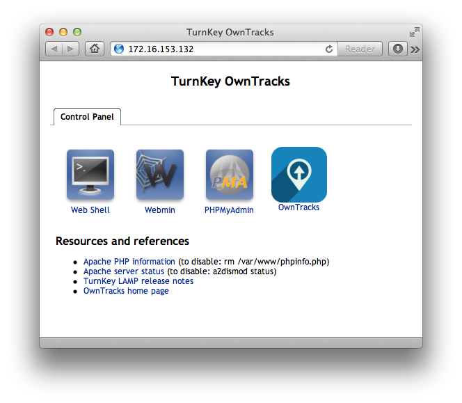

# TKL OwnTracks backend

This is an [OwnTracks](http://owntracks.org) TurnKey-Linux back-end, with the following features:

* Latest version of the [Mosquitto](http://mosquitto.org) MQTT broker
* Pre-configured to use TLS with automatically created CA and server certificate/key
* Broker listens on 127.0.0.1 for plain and on *:8883 for TLS connections
* m2s back-end is automatically launched via supervisord
* Mosquitto and m2s logs written to `/var/log/mosquitto/`
* WSS #FIXME
* [HiveMQ MQTT Websocket client](https://github.com/hivemq/hivemq-mqtt-web-client)

### Bugs

* Yes, many.
* Irrespective of MySQL password set upon installation, the username and password for `owntracks` database are `a` and `a` respectively.
